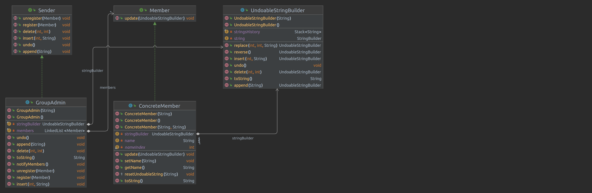

#  

# sdklajsdl

### dakaskldaskld

asmdlkasjdlaks [asjldhakjsd](https://github.com/eytan1998/OOP1)

asmdlkasjdlaks [asd](src/main/java/GroupAdmin.java)

``` 
sudo apt-get install python
```
# Exercise 1 observer pattern
## Overview

## Installation

1. Download the repository files (project) from the download section or clone this project by typing in the bash the
   following command:

```
    git clone https://github.com/eytan1998/OOP1.git
```

2. Imported it in Intellij IDEA or any other Java IDE.
3. Run the program :D

## observer pattern

observer pattern is a software design pattern in which an object, named the subject (observable),
maintains a list of its members, called observers, and notifies them automatically of any state changes,
by calling the update method.

The algorithm works so that there is one will follow that has many "followers".
The "followers" will receive a notification when something changes in the one will follow!!! and they will be able to
update the information they have with the latest information
The algorithm will be implemented so that the follower contains a list of all the "followers" who receive the updates,
and he is the one who can change the list.
## UML

## [GroupAdmin](src/main/java/GroupAdmin.java) (observables)

GroupAdmin implement Sender
GroupAdmin contain
UndoableStringBuilder
LinkedList<Member>

the LinkedList<Member> contains all the Members who follow the GroupAdmin

the UndoableStringBuilder is what the ConcreteMembers follow and want to be ---- when it changes

### register

ConcreteMember can follow a GroupAdmin several times,and when he is -----, he will be ----- for each of the
registrations

### unregister

when you're unregistered you don't get anymore --- and your UndoableStringBuilder won't change either

if the ConcreteMember a several times to disconnect it completely, you need disconnect as many times as you connected.
If we disconnected completely inside to unregister we will create a new UndoableStringBuilder that will contain the
content of the GroupAdmin.UndoableStringBuilder
And the ConcreteMember.UndoableStringBuilder will point to the new UndoableStringBuilder.so f

### notifyMembers

We inform all members that there is a new update, and they are updated

we decided that when ConcreteMember unregister, so he won't be able to undo()_____ he will be disconnected from the
stack

if you register in the first time your UndoableStringBuilder will not be !!! connected to the
GroupAdmin.UndoableStringBuilder until a notify is called

when you register in the first time all your UndoableStringBuilder history override by observable

## [ConcreteMember](src/main/java/ConcreteMember.java) (observer)

ConcreteMember implement Member
ConcreteMember contain

UndoableStringBuilder stringBuilder;

String name;

int nameIndex = 1;

name and nameIndex their purpose is only so that we can identify different ConcreteMember(and we will use nameIndex when
no names have been entered for the ConcreteMember)

the ConcreteMember follow after the 


